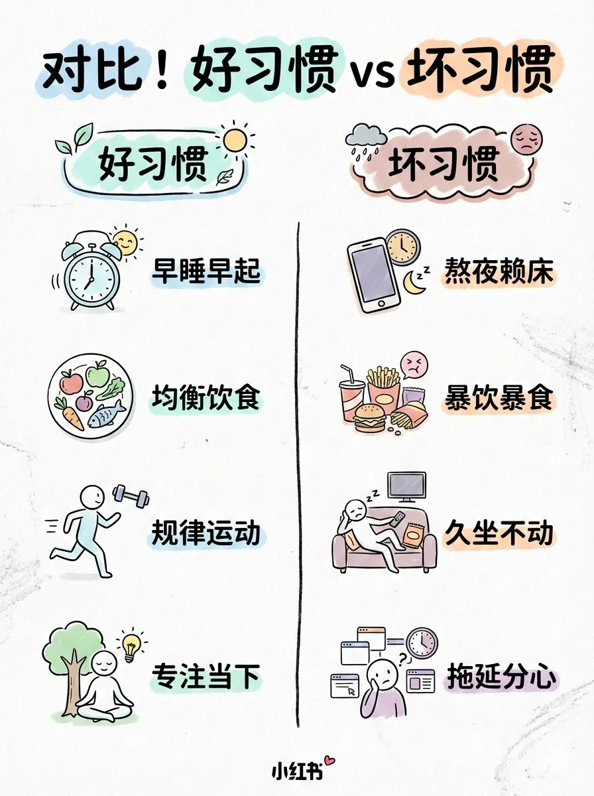
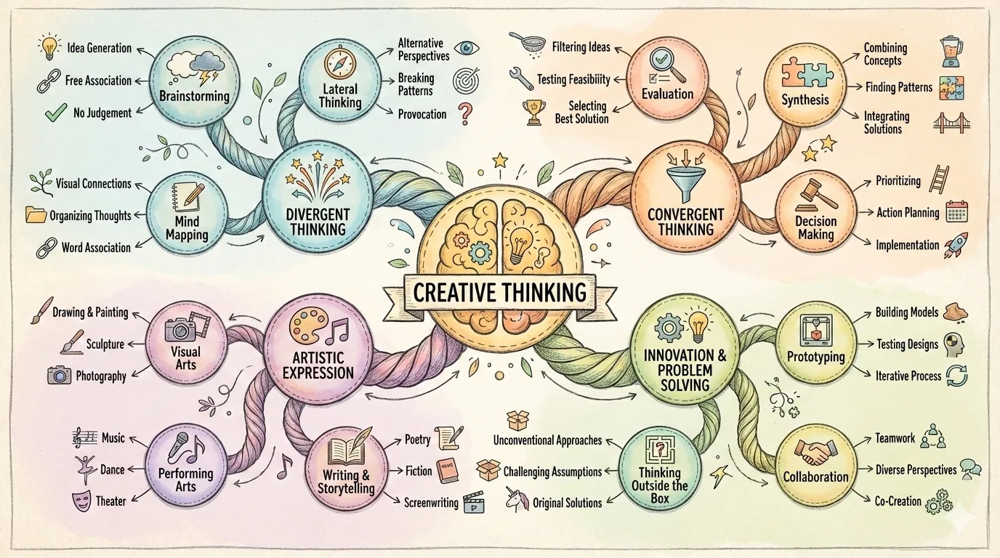
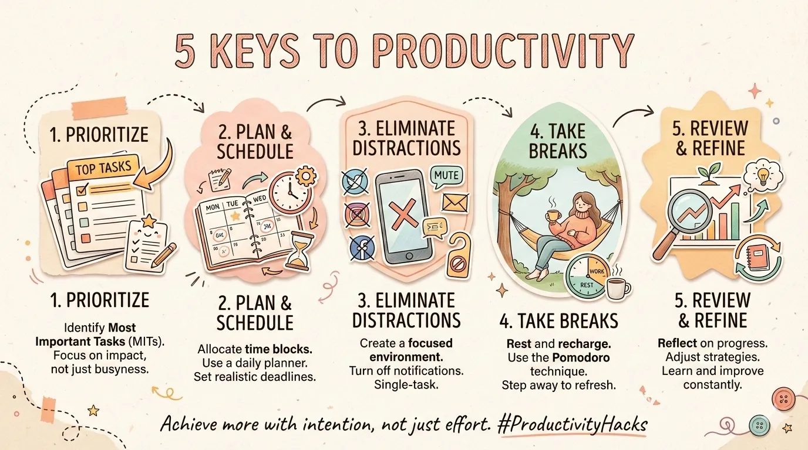
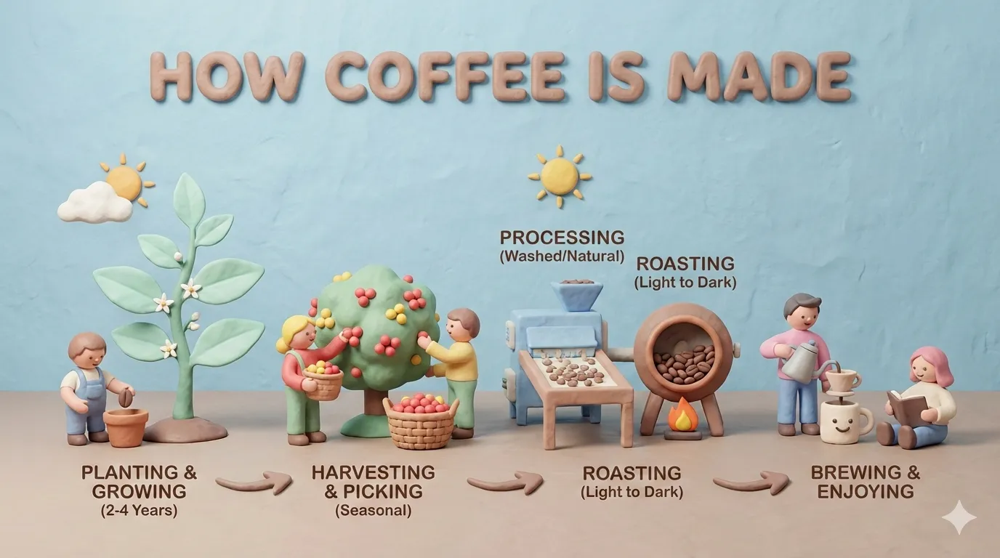
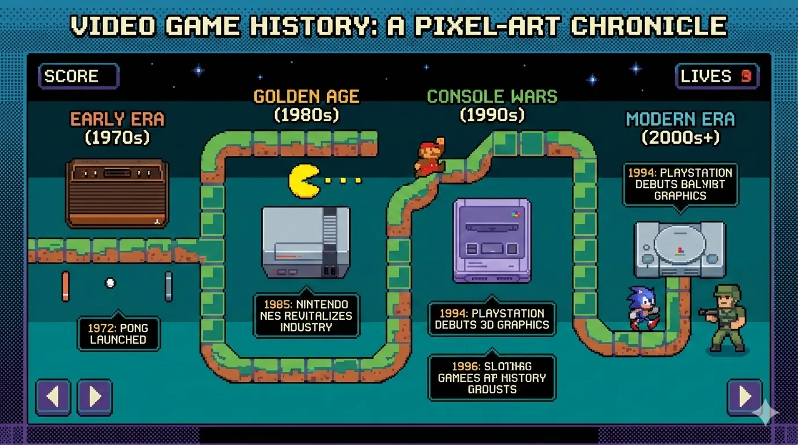
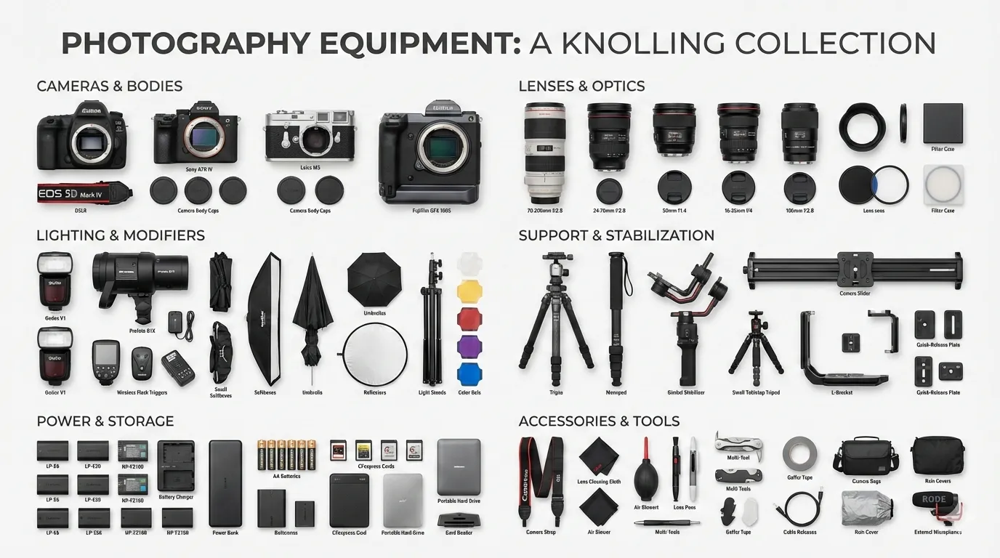
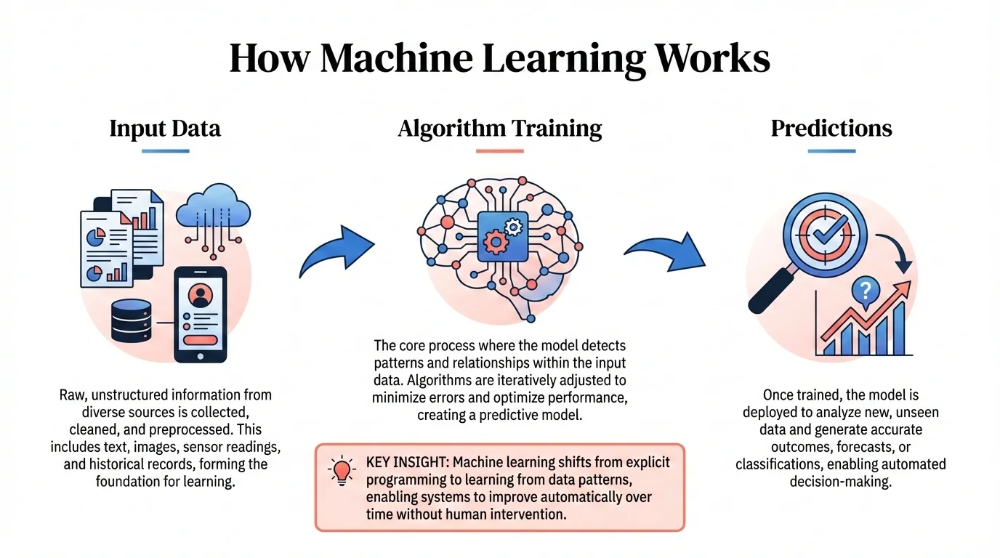
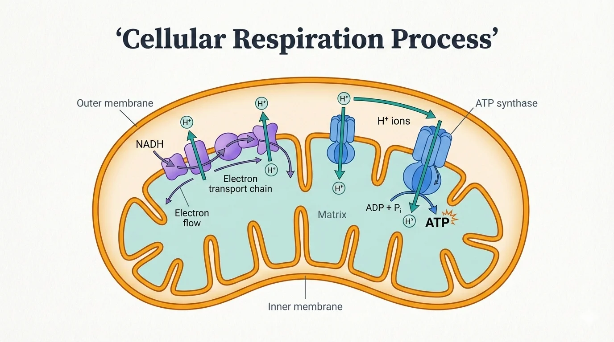
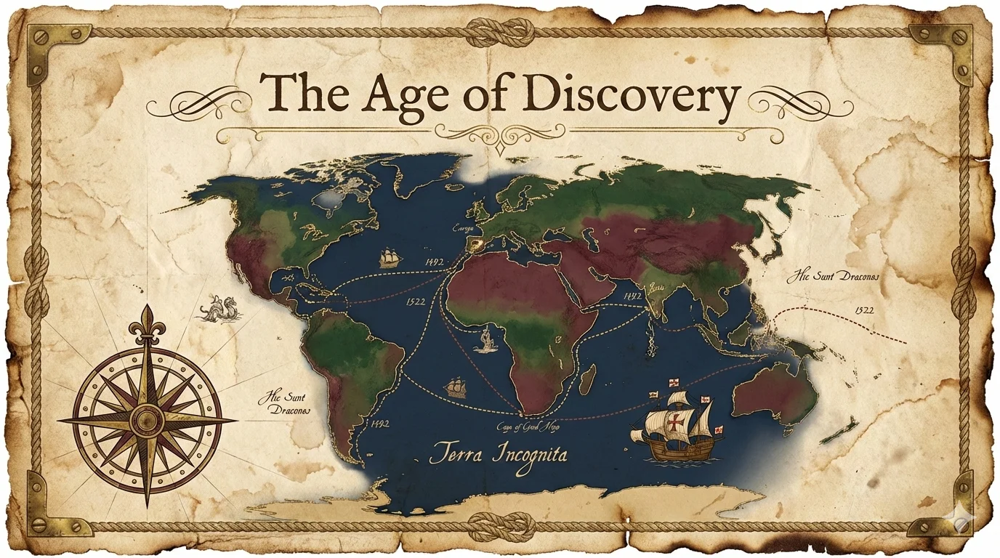
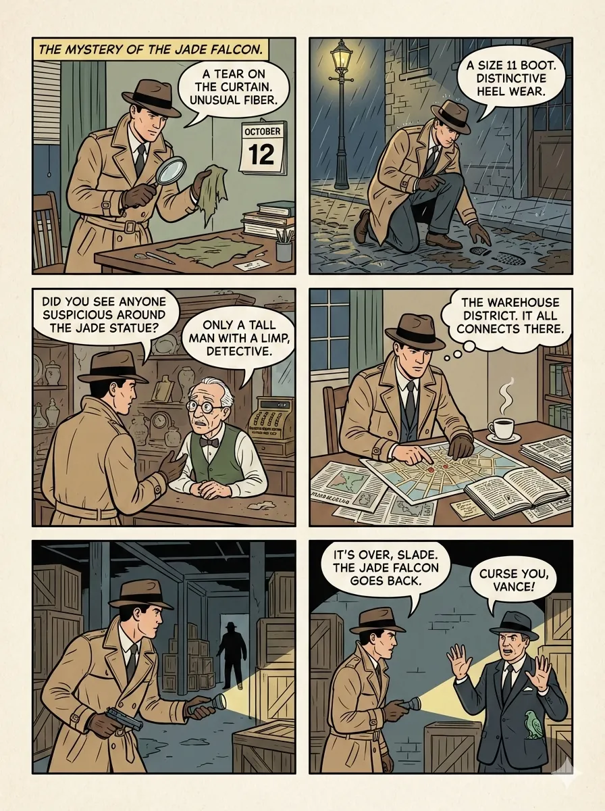

# baoyu-skills

[English](./README.md) | 中文

宝玉分享的技能集，用于通过 Claude Code 提升日常工作效率。

## 前置要求

- 已安装 Node.js 环境
- 能够运行 `npx bun` 命令

## 安装

### 快速安装（推荐）

```bash
npx skills add jimliu/baoyu-skills
```

### 发布到 ClawHub / OpenClaw

本仓库支持将每个 `skills/baoyu-*` 目录作为独立的 ClawHub 技能进行发布。

```bash
# 预览将要发布的内容
./scripts/sync-clawhub.sh --dry-run

# 从 ./skills 发布所有已更改的技能
./scripts/sync-clawhub.sh --all
```

ClawHub 以单个技能为单位安装，而非整个 marketplace 包。发布后，用户可以安装特定技能，例如：

```bash
clawhub install baoyu-image-gen
clawhub install baoyu-markdown-to-html
```

发布到 ClawHub 将按照 ClawHub 注册表规则以 `MIT-0` 许可证发布。

### 注册为插件市场

在 Claude Code 中运行以下命令：

```bash
/plugin marketplace add JimLiu/baoyu-skills
```

### 安装技能

**方式一：通过浏览界面**

1. 选择 **Browse and install plugins**
2. 选择 **baoyu-skills**
3. 选择你想安装的插件
4. 选择 **Install now**

**方式二：直接安装**

```bash
# 安装特定插件
/plugin install content-skills@baoyu-skills
/plugin install ai-generation-skills@baoyu-skills
/plugin install utility-skills@baoyu-skills
```

**方式三：让 Agent 帮你安装**

直接告诉 Claude Code：

> 请从 github.com/JimLiu/baoyu-skills 安装技能

### 可用插件

| 插件 | 描述 | 技能 |
|------|------|------|
| **content-skills** | 内容生成与发布 | [xhs-images](#baoyu-xhs-images), [infographic](#baoyu-infographic), [cover-image](#baoyu-cover-image), [slide-deck](#baoyu-slide-deck), [comic](#baoyu-comic), [article-illustrator](#baoyu-article-illustrator), [post-to-x](#baoyu-post-to-x), [post-to-wechat](#baoyu-post-to-wechat), [post-to-weibo](#baoyu-post-to-weibo) |
| **ai-generation-skills** | AI 驱动的生成后端 | [image-gen](#baoyu-image-gen), [danger-gemini-web](#baoyu-danger-gemini-web) |
| **utility-skills** | 内容处理工具集 | [youtube-transcript](#baoyu-youtube-transcript), [url-to-markdown](#baoyu-url-to-markdown), [danger-x-to-markdown](#baoyu-danger-x-to-markdown), [compress-image](#baoyu-compress-image), [format-markdown](#baoyu-format-markdown), [markdown-to-html](#baoyu-markdown-to-html), [translate](#baoyu-translate) |

## 更新技能

要更新技能到最新版本：

1. 在 Claude Code 中运行 `/plugin`
2. 切换到 **Marketplaces** 标签页（使用方向键或 Tab）
3. 选择 **baoyu-skills**
4. 选择 **Update marketplace**

你也可以 **Enable auto-update** 来自动获取最新版本。


## 可用技能

技能分为三个类别：

### 内容技能

内容生成与发布技能。

#### baoyu-xhs-images

小红书信息图系列生成器。将内容拆分为 1-10 张卡通风格的信息图，采用 **风格 × 布局** 二维系统。

```bash
# 自动选择风格和布局
/baoyu-xhs-images posts/ai-future/article.md

# 指定风格
/baoyu-xhs-images posts/ai-future/article.md --style notion

# 指定布局
/baoyu-xhs-images posts/ai-future/article.md --layout dense

# 组合风格和布局
/baoyu-xhs-images posts/ai-future/article.md --style tech --layout list

# 直接输入内容
/baoyu-xhs-images 今日星座运势
```

**风格**（视觉美学）：`cute`（默认）, `fresh`, `warm`, `bold`, `minimal`, `retro`, `pop`, `notion`, `chalkboard`

**风格预览**：

| | | |
|:---:|:---:|:---:|
|  |  |  |
| cute | fresh | warm |
|  |  |  |
| bold | minimal | retro |
|  |  |  |
| pop | notion | chalkboard |

**布局**（信息密度）：
| 布局 | 密度 | 适用场景 |
|------|------|----------|
| `sparse` | 1-2 个要点 | 封面、引用 |
| `balanced` | 3-4 个要点 | 常规内容 |
| `dense` | 5-8 个要点 | 知识卡片、速查表 |
| `list` | 4-7 个条目 | 清单、排行 |
| `comparison` | 2 侧对比 | 前后对比、优缺点 |
| `flow` | 3-6 个步骤 | 流程、时间线 |

**布局预览**：

| | | |
|:---:|:---:|:---:|
|  |  |  |
| sparse | balanced | dense |
|  |  |  |
| list | comparison | flow |

#### baoyu-infographic

生成专业信息图，提供 20 种布局类型和 17 种视觉风格。分析内容，推荐布局×风格组合，生成可直接发布的信息图。

```bash
# 根据内容自动推荐组合
/baoyu-infographic path/to/content.md

# 指定布局
/baoyu-infographic path/to/content.md --layout pyramid

# 指定风格（默认：craft-handmade）
/baoyu-infographic path/to/content.md --style technical-schematic

# 同时指定
/baoyu-infographic path/to/content.md --layout funnel --style corporate-memphis

# 指定宽高比（命名预设或自定义 W:H）
/baoyu-infographic path/to/content.md --aspect portrait
/baoyu-infographic path/to/content.md --aspect 3:4
```

**选项**：
| 选项 | 描述 |
|------|------|
| `--layout <name>` | 信息布局（20 种可选） |
| `--style <name>` | 视觉风格（17 种可选，默认：craft-handmade） |
| `--aspect <ratio>` | 命名预设：landscape (16:9)、portrait (9:16)、square (1:1)。自定义：任意 W:H 比例（如 3:4、4:3、2.35:1） |
| `--lang <code>` | 输出语言（en、zh、ja 等） |

**布局**（信息结构）：

| 布局 | 适用场景 |
|------|----------|
| `bridge` | 问题-解决方案、跨越差距 |
| `circular-flow` | 循环、周期性流程 |
| `comparison-table` | 多因素对比 |
| `do-dont` | 正确 vs 错误做法 |
| `equation` | 公式分解、输入-输出 |
| `feature-list` | 产品特性、要点列表 |
| `fishbone` | 根因分析 |
| `funnel` | 转化流程、筛选 |
| `grid-cards` | 多主题、概览 |
| `iceberg` | 表面 vs 隐藏部分 |
| `journey-path` | 用户旅程、里程碑 |
| `layers-stack` | 技术栈、分层 |
| `mind-map` | 头脑风暴、思维导图 |
| `nested-circles` | 影响层次、范围 |
| `priority-quadrants` | 艾森豪威尔矩阵、2×2 象限 |
| `pyramid` | 层级结构、马斯洛需求 |
| `scale-balance` | 优劣权衡 |
| `timeline-horizontal` | 历史、时间线事件 |
| `tree-hierarchy` | 组织架构、分类体系 |
| `venn` | 重叠概念 |

**布局预览**：

| | | |
|:---:|:---:|:---:|
|  |  |  |
| bridge | circular-flow | comparison-table |
|  |  |  |
| do-dont | equation | feature-list |
|  |  |  |
| fishbone | funnel | grid-cards |
|  |  |  |
| iceberg | journey-path | layers-stack |
|  |  |  |
| mind-map | nested-circles | priority-quadrants |
|  |  |  |
| pyramid | scale-balance | timeline-horizontal |
|  |  | |
| tree-hierarchy | venn | |

**风格**（视觉美学）：

| 风格 | 描述 |
|------|------|
| `craft-handmade`（默认） | 手绘插画，纸质工艺美学 |
| `claymation` | 3D 粘土人物，趣味定格动画 |
| `kawaii` | 日系可爱风，大眼睛，粉彩色调 |
| `storybook-watercolor` | 柔和水彩插画，童话风 |
| `chalkboard` | 黑板上的彩色粉笔画 |
| `cyberpunk-neon` | 暗色背景霓虹辉光，未来感 |
| `bold-graphic` | 漫画风格，半调网点，高对比度 |
| `aged-academia` | 复古学术风，泛黄素描 |
| `corporate-memphis` | 扁平矢量人物，鲜艳填充 |
| `technical-schematic` | 蓝图风，等距 3D，工程图 |
| `origami` | 折纸造型，几何风 |
| `pixel-art` | 复古 8-bit，怀旧游戏风 |
| `ui-wireframe` | 灰度框线，界面原型风 |
| `subway-map` | 地铁线路图，彩色线条 |
| `ikea-manual` | 极简线描，组装说明风 |
| `knolling` | 有序平铺，俯视视角 |
| `lego-brick` | 乐高积木拼搭，童趣风 |

**风格预览**：

| | | |
|:---:|:---:|:---:|
|  |  |  |
| craft-handmade | claymation | kawaii |
|  |  |  |
| storybook-watercolor | chalkboard | cyberpunk-neon |
|  |  |  |
| bold-graphic | aged-academia | corporate-memphis |
|  |  |  |
| technical-schematic | origami | pixel-art |
|  |  |  |
| ui-wireframe | subway-map | ikea-manual |
|  |  | |
| knolling | lego-brick | |

#### baoyu-cover-image

为文章生成封面图，采用 5 个维度：类型 × 配色 × 渲染 × 文字 × 氛围。9 种配色方案与 6 种渲染风格组合出 54 种独特效果。

```bash
# 根据内容自动选择所有维度
/baoyu-cover-image path/to/article.md

# 快速模式：跳过确认，使用自动选择
/baoyu-cover-image path/to/article.md --quick

# 指定维度（5D 系统）
/baoyu-cover-image path/to/article.md --type conceptual --palette cool --rendering digital
/baoyu-cover-image path/to/article.md --text title-subtitle --mood bold

# 风格预设（向后兼容的简写）
/baoyu-cover-image path/to/article.md --style blueprint

# 指定宽高比（默认：16:9）
/baoyu-cover-image path/to/article.md --aspect 2.35:1

# 仅视觉效果（无标题文字）
/baoyu-cover-image path/to/article.md --no-title
```

**五个维度**：
- **类型**：`hero`、`conceptual`、`typography`、`metaphor`、`scene`、`minimal`
- **配色**：`warm`、`elegant`、`cool`、`dark`、`earth`、`vivid`、`pastel`、`mono`、`retro`
- **渲染**：`flat-vector`、`hand-drawn`、`painterly`、`digital`、`pixel`、`chalk`
- **文字**：`none`、`title-only`（默认）、`title-subtitle`、`text-rich`
- **氛围**：`subtle`、`balanced`（默认）、`bold`

#### baoyu-slide-deck

从内容生成专业幻灯片图片。先创建包含风格指导的完整大纲，然后逐页生成幻灯片图片。

```bash
# 从 markdown 文件
/baoyu-slide-deck path/to/article.md

# 指定风格和受众
/baoyu-slide-deck path/to/article.md --style corporate
/baoyu-slide-deck path/to/article.md --audience executives

# 目标页数
/baoyu-slide-deck path/to/article.md --slides 15

# 仅生成大纲（不生成图片）
/baoyu-slide-deck path/to/article.md --outline-only

# 指定语言
/baoyu-slide-deck path/to/article.md --lang zh
```

**选项**：

| 选项 | 描述 |
|------|------|
| `--style <name>` | 视觉风格：预设名称或 `custom` |
| `--audience <type>` | 目标受众：beginners、intermediate、experts、executives、general |
| `--lang <code>` | 输出语言（en、zh、ja 等） |
| `--slides <number>` | 目标页数（推荐 8-25，最多 30） |
| `--outline-only` | 仅生成大纲，跳过图片 |
| `--prompts-only` | 生成大纲和提示词，跳过图片 |
| `--images-only` | 从已有提示词生成图片 |
| `--regenerate <N>` | 重新生成特定幻灯片：`3` 或 `2,5,8` |

**风格系统**：

风格由 4 个维度构建：**质感** × **氛围** × **字体** × **密度**

| 维度 | 选项 |
|------|------|
| 质感 | clean、grid、organic、pixel、paper |
| 氛围 | professional、warm、cool、vibrant、dark、neutral |
| 字体 | geometric、humanist、handwritten、editorial、technical |
| 密度 | minimal、balanced、dense |

**预设**（预配置的维度组合）：

| 预设 | 维度 | 适用场景 |
|------|------|----------|
| `blueprint`（默认） | grid + cool + technical + balanced | 架构设计、系统设计 |
| `chalkboard` | organic + warm + handwritten + balanced | 教育、教程 |
| `corporate` | clean + professional + geometric + balanced | 投资者演示、提案 |
| `minimal` | clean + neutral + geometric + minimal | 高管简报 |
| `sketch-notes` | organic + warm + handwritten + balanced | 教育、教程 |
| `watercolor` | organic + warm + humanist + minimal | 生活方式、健康 |
| `dark-atmospheric` | clean + dark + editorial + balanced | 娱乐、游戏 |
| `notion` | clean + neutral + geometric + dense | 产品演示、SaaS |
| `bold-editorial` | clean + vibrant + editorial + balanced | 产品发布、主题演讲 |
| `editorial-infographic` | clean + cool + editorial + dense | 技术解读、研究 |
| `fantasy-animation` | organic + vibrant + handwritten + minimal | 教育故事 |
| `intuition-machine` | clean + cool + technical + dense | 技术文档、学术 |
| `pixel-art` | pixel + vibrant + technical + balanced | 游戏、开发者演讲 |
| `scientific` | clean + cool + technical + dense | 生物、化学、医学 |
| `vector-illustration` | clean + vibrant + humanist + balanced | 创意、儿童内容 |
| `vintage` | paper + warm + editorial + balanced | 历史、传承 |

**风格预览**：

| | | |
|:---:|:---:|:---:|
|  |  |  |
| blueprint | chalkboard | bold-editorial |
|  |  |  |
| corporate | dark-atmospheric | editorial-infographic |
|  |  |  |
| fantasy-animation | intuition-machine | minimal |
|  |  |  |
| notion | pixel-art | scientific |
|  |  |  |
| sketch-notes | vector-illustration | vintage |
|  | | |
| watercolor | | |

生成后，幻灯片会自动合并为 `.pptx` 和 `.pdf` 文件，方便分享。

#### baoyu-comic

知识漫画创作工具，支持灵活的画风 × 基调组合。创建原创教育漫画，包含详细的分镜布局和逐页图片生成。

```bash
# 从源素材（自动选择画风和基调）
/baoyu-comic posts/turing-story/source.md

# 指定画风和基调
/baoyu-comic posts/turing-story/source.md --art manga --tone warm
/baoyu-comic posts/turing-story/source.md --art ink-brush --tone dramatic

# 使用预设（包含特殊规则）
/baoyu-comic posts/turing-story/source.md --style ohmsha
/baoyu-comic posts/turing-story/source.md --style wuxia

# 指定布局和宽高比
/baoyu-comic posts/turing-story/source.md --layout cinematic
/baoyu-comic posts/turing-story/source.md --aspect 16:9

# 指定语言
/baoyu-comic posts/turing-story/source.md --lang zh

# 直接输入内容
/baoyu-comic "图灵的故事与计算机科学的诞生"
```

**选项**：
| 选项 | 可选值 |
|------|--------|
| `--art` | `ligne-claire`（默认）、`manga`、`realistic`、`ink-brush`、`chalk` |
| `--tone` | `neutral`（默认）、`warm`、`dramatic`、`romantic`、`energetic`、`vintage`、`action` |
| `--style` | `ohmsha`、`wuxia`、`shoujo`（含特殊规则的预设） |
| `--layout` | `standard`（默认）、`cinematic`、`dense`、`splash`、`mixed`、`webtoon` |
| `--aspect` | `3:4`（默认，竖版）、`4:3`（横版）、`16:9`（宽屏） |
| `--lang` | `auto`（默认）、`zh`、`en`、`ja` 等 |

**画风**（渲染技法）：

| 画风 | 描述 |
|------|------|
| `ligne-claire` | 均匀线条、平涂色彩、欧洲漫画传统（丁丁历险记、Logicomix） |
| `manga` | 大眼睛、漫画手法、表情丰富 |
| `realistic` | 数字绘画、写实比例、精致风格 |
| `ink-brush` | 中国毛笔笔触、水墨效果 |
| `chalk` | 黑板风格、手绘温暖感 |

**基调**（情绪/氛围）：

| 基调 | 描述 |
|------|------|
| `neutral` | 均衡、理性、教育性 |
| `warm` | 怀旧、亲切、温馨 |
| `dramatic` | 高对比度、激烈、有力 |
| `romantic` | 柔美、华丽、装饰元素 |
| `energetic` | 明亮、动感、激动人心 |
| `vintage` | 历史感、复古、时代感 |
| `action` | 速度线、冲击效果、打斗 |

**预设**（画风 + 基调 + 特殊规则）：

| 预设 | 等效于 | 特殊规则 |
|------|--------|----------|
| `ohmsha` | manga + neutral | 视觉隐喻、禁止对话头像、道具揭示 |
| `wuxia` | ink-brush + action | 气效果、战斗画面、氛围元素 |
| `shoujo` | manga + romantic | 装饰元素、眼部细节、浪漫节拍 |

**布局**（分格排列）：
| 布局 | 每页格数 | 适用场景 |
|------|----------|----------|
| `standard` | 4-6 | 对话、叙事流 |
| `cinematic` | 2-4 | 戏剧性场景、全景镜头 |
| `dense` | 6-9 | 技术说明、时间线 |
| `splash` | 1-2 大格 | 关键时刻、揭示 |
| `mixed` | 3-7 混合 | 复杂叙事、情感弧 |
| `webtoon` | 3-5 竖向 | Ohmsha 教程、移动端阅读 |

**布局预览**：

| | | |
|:---:|:---:|:---:|
|  |  |  |
| standard | cinematic | dense |
|  |  |  |
| splash | mixed | webtoon |

#### baoyu-article-illustrator

智能文章配图技能，采用类型 × 风格二维方式。分析文章结构，识别需要配图的位置，生成插图。

```bash
# 根据内容自动选择类型和风格
/baoyu-article-illustrator path/to/article.md

# 指定类型
/baoyu-article-illustrator path/to/article.md --type infographic

# 指定风格
/baoyu-article-illustrator path/to/article.md --style blueprint

# 组合类型和风格
/baoyu-article-illustrator path/to/article.md --type flowchart --style notion
```

**类型**（信息结构）：

| 类型 | 描述 | 适用场景 |
|------|------|----------|
| `infographic` | 数据可视化、图表、指标 | 技术文章、数据分析 |
| `scene` | 氛围插画、情绪渲染 | 叙事、个人故事 |
| `flowchart` | 流程图、步骤可视化 | 教程、工作流 |
| `comparison` | 并列对比、前后对照 | 产品对比 |
| `framework` | 概念图、关系图 | 方法论、架构 |
| `timeline` | 时间进程 | 历史、项目进度 |

**风格**（视觉美学）：

| 风格 | 描述 | 适用场景 |
|------|------|----------|
| `notion`（默认） | 极简手绘线条画 | 知识分享、SaaS、效率工具 |
| `elegant` | 精致、高雅 | 商业、思想领袖 |
| `warm` | 友好、亲切 | 个人成长、生活方式 |
| `minimal` | 超简洁、禅意 | 哲学、极简主义 |
| `blueprint` | 技术原理图 | 架构、系统设计 |
| `watercolor` | 柔和水彩、自然温暖 | 生活方式、旅行、创意 |
| `editorial` | 杂志风信息图 | 技术解读、新闻 |
| `scientific` | 学术精确图表 | 生物、化学、技术 |

**风格预览**：

| | | |
|:---:|:---:|:---:|
|  |  |  |
| notion | elegant | warm |
|  |  |  |
| minimal | blueprint | watercolor |
|  |  | |
| editorial | scientific | |

#### baoyu-post-to-x

将内容和文章发布到 X (Twitter)。支持带图片的普通帖子和 X Articles（长文 Markdown）。使用真实 Chrome 通过 CDP 绕过反自动化检测。

纯文本输入视为普通帖子。Markdown 文件视为 X Articles。脚本将内容填入浏览器，用户审核后手动发布。

```bash
# 发布文字
/baoyu-post-to-x "Hello from Claude Code!"

# 发布带图片的帖子
/baoyu-post-to-x "Check this out" --image photo.png

# 发布 X Article
/baoyu-post-to-x --article path/to/article.md
```

#### baoyu-post-to-wechat

将内容发布到微信公众号。提供两种模式：

**图文（贴图）** - 多张图片配简短标题/内容：

```bash
/baoyu-post-to-wechat 贴图 --markdown article.md --images ./photos/
/baoyu-post-to-wechat 贴图 --markdown article.md --image img1.png --image img2.png --image img3.png
/baoyu-post-to-wechat 贴图 --title "标题" --content "内容" --image img1.png --submit
```

**文章** - 完整的 markdown/HTML 富文本格式：

```bash
/baoyu-post-to-wechat 文章 --markdown article.md
/baoyu-post-to-wechat 文章 --markdown article.md --theme grace
/baoyu-post-to-wechat 文章 --html article.html
```

**发布方式**：

| 方式 | 速度 | 要求 |
|------|------|------|
| API（推荐） | 快速 | API 凭证 |
| 浏览器 | 较慢 | Chrome，登录会话 |

**API 配置**（更快的发布方式）：

```bash
# 添加到 .baoyu-skills/.env（项目级）或 ~/.baoyu-skills/.env（用户级）
WECHAT_APP_ID=your_app_id
WECHAT_APP_SECRET=your_app_secret
```

获取凭证：
1. 访问 https://developers.weixin.qq.com/platform/
2. 进入：我的业务 → 公众号 → 开发密钥
3. 创建开发密钥并复制 AppID/AppSecret
4. 将你的机器 IP 加入白名单

**浏览器方式**（无需 API 配置）：需要 Google Chrome。首次运行会打开浏览器扫码登录（会话会保持）。

**多账号支持**：通过 `EXTEND.md` 管理多个微信公众号：

```bash
mkdir -p .baoyu-skills/baoyu-post-to-wechat
```

创建 `.baoyu-skills/baoyu-post-to-wechat/EXTEND.md`：

```yaml
# 全局设置（所有账号共享）
default_theme: default
default_color: blue

# 账号列表
accounts:
  - name: My Tech Blog
    alias: tech-blog
    default: false
    default_publish_method: api
    default_author: Author Name
    need_open_comment: 1
    only_fans_can_comment: 0
    app_id: your_wechat_app_id
    app_secret: your_wechat_app_secret
  - name: AI Newsletter
    alias: ai-news
    default_publish_method: browser
    default_author: AI Newsletter
    need_open_comment: 1
    only_fans_can_comment: 0
```

| 配置的账号数 | 行为 |
|--------------|------|
| 无 `accounts` 块 | 单账号模式（向后兼容） |
| 1 个账号 | 自动选择，无提示 |
| 2+ 个账号 | 提示选择，或使用 `--account <alias>` |
| 1 个账号设置了 `default: true` | 预选为默认账号 |

每个账号拥有独立的 Chrome 配置文件，实现独立的登录会话（浏览器方式）。API 凭证可在 EXTEND.md 中内联设置，或通过 `.env` 使用别名前缀的键（如 `WECHAT_TECH_BLOG_APP_ID`）。

#### baoyu-post-to-weibo

将内容发布到微博。支持带文字、图片和视频的普通帖子，以及头条文章（Markdown 输入）。使用真实 Chrome 通过 CDP 绕过反自动化检测。

**普通帖子** - 文字 + 图片/视频（最多 18 个文件）：

```bash
# 发布文字
/baoyu-post-to-weibo "Hello Weibo!"

# 发布带图片的帖子
/baoyu-post-to-weibo "Check this out" --image photo.png

# 发布带视频的帖子
/baoyu-post-to-weibo "Watch this" --video clip.mp4
```

**头条文章** - 长文 Markdown：

```bash
# 发布文章
/baoyu-post-to-weibo --article article.md

# 附带封面图
/baoyu-post-to-weibo --article article.md --cover cover.jpg
```

**文章选项**：
| 选项 | 描述 |
|------|------|
| `--cover <path>` | 封面图 |
| `--title <text>` | 覆盖标题（最多 32 字符） |
| `--summary <text>` | 覆盖摘要（最多 44 字符） |

**注意**：脚本将内容填入浏览器。用户审核后手动发布。首次运行需要手动登录微博（会话会保持）。

### AI 生成技能

AI 驱动的生成后端。

#### baoyu-image-gen

基于 AI SDK 的图片生成，支持 OpenAI、Google、OpenRouter、DashScope（阿里云通义万相）、即梦、Seedream（豆包）和 Replicate API。支持文生图、参考图、宽高比和质量预设。

```bash
# 基本生成（自动检测提供商）
/baoyu-image-gen --prompt "A cute cat" --image cat.png

# 指定宽高比
/baoyu-image-gen --prompt "A landscape" --image landscape.png --ar 16:9

# 高质量（2k）
/baoyu-image-gen --prompt "A banner" --image banner.png --quality 2k

# 指定提供商
/baoyu-image-gen --prompt "A cat" --image cat.png --provider openai

# OpenRouter
/baoyu-image-gen --prompt "A cat" --image cat.png --provider openrouter

# DashScope（阿里云通义万相）
/baoyu-image-gen --prompt "一只可爱的猫" --image cat.png --provider dashscope

# Replicate
/baoyu-image-gen --prompt "A cat" --image cat.png --provider replicate

# 即梦
/baoyu-image-gen --prompt "一只可爱的猫" --image cat.png --provider jimeng

# Seedream（豆包）
/baoyu-image-gen --prompt "一只可爱的猫" --image cat.png --provider seedream

# 使用参考图（Google、OpenAI、OpenRouter、Replicate 或 Seedream 5.0/4.5/4.0）
/baoyu-image-gen --prompt "Make it blue" --image out.png --ref source.png
```

**选项**：
| 选项 | 描述 |
|------|------|
| `--prompt`, `-p` | 提示词文本 |
| `--promptfiles` | 从文件读取提示词（拼接） |
| `--image` | 输出图片路径（必填） |
| `--provider` | `google`、`openai`、`openrouter`、`dashscope`、`jimeng`、`seedream` 或 `replicate`（默认：自动检测，优先 google） |
| `--model`, `-m` | 模型 ID |
| `--ar` | 宽高比（如 `16:9`、`1:1`、`4:3`） |
| `--size` | 尺寸（如 `1024x1024`） |
| `--quality` | `normal` 或 `2k`（默认：`2k`） |
| `--ref` | 参考图（Google、OpenAI、OpenRouter、Replicate 或 Seedream 5.0/4.5/4.0） |

**环境变量**（设置方式见[环境配置](#环境配置)）：
| 变量 | 描述 | 默认值 |
|------|------|--------|
| `OPENAI_API_KEY` | OpenAI API 密钥 | - |
| `OPENROUTER_API_KEY` | OpenRouter API 密钥 | - |
| `GOOGLE_API_KEY` | Google API 密钥 | - |
| `DASHSCOPE_API_KEY` | DashScope API 密钥（阿里云） | - |
| `REPLICATE_API_TOKEN` | Replicate API 令牌 | - |
| `JIMENG_ACCESS_KEY_ID` | 即梦火山引擎 access key | - |
| `JIMENG_SECRET_ACCESS_KEY` | 即梦火山引擎 secret key | - |
| `ARK_API_KEY` | Seedream 火山引擎 ARK API 密钥 | - |
| `OPENAI_IMAGE_MODEL` | OpenAI 模型 | `gpt-image-1.5` |
| `OPENROUTER_IMAGE_MODEL` | OpenRouter 模型 | `google/gemini-3.1-flash-image-preview` |
| `GOOGLE_IMAGE_MODEL` | Google 模型 | `gemini-3-pro-image-preview` |
| `DASHSCOPE_IMAGE_MODEL` | DashScope 模型 | `qwen-image-2.0-pro` |
| `REPLICATE_IMAGE_MODEL` | Replicate 模型 | `google/nano-banana-pro` |
| `JIMENG_IMAGE_MODEL` | 即梦模型 | `jimeng_t2i_v40` |
| `SEEDREAM_IMAGE_MODEL` | Seedream 模型 | `doubao-seedream-5-0-260128` |
| `OPENAI_BASE_URL` | 自定义 OpenAI 端点 | - |
| `OPENROUTER_BASE_URL` | 自定义 OpenRouter 端点 | `https://openrouter.ai/api/v1` |
| `GOOGLE_BASE_URL` | 自定义 Google 端点 | - |
| `DASHSCOPE_BASE_URL` | 自定义 DashScope 端点 | - |
| `REPLICATE_BASE_URL` | 自定义 Replicate 端点 | - |
| `JIMENG_BASE_URL` | 自定义即梦端点 | `https://visual.volcengineapi.com` |
| `JIMENG_REGION` | 即梦区域 | `cn-north-1` |
| `SEEDREAM_BASE_URL` | 自定义 Seedream 端点 | `https://ark.cn-beijing.volces.com/api/v3` |

**提供商自动选择**：
1. 如果指定了 `--provider` → 使用该提供商
2. 如果只有一个 API 密钥可用 → 使用该提供商
3. 如果多个可用 → 默认使用 Google

#### baoyu-danger-gemini-web

通过 Gemini Web 交互生成文本和图片。

**文本生成：**

```bash
/baoyu-danger-gemini-web "Hello, Gemini"
/baoyu-danger-gemini-web --prompt "Explain quantum computing"
```

**图片生成：**

```bash
/baoyu-danger-gemini-web --prompt "A cute cat" --image cat.png
/baoyu-danger-gemini-web --promptfiles system.md content.md --image out.png
```

### 工具技能

内容处理工具集。

#### baoyu-youtube-transcript

下载 YouTube 视频的字幕/转录文本和封面图。支持多语言、翻译、章节和说话人识别。缓存原始数据以便快速重新格式化。

```bash
# 默认：带时间戳的 markdown
/baoyu-youtube-transcript https://www.youtube.com/watch?v=VIDEO_ID

# 指定语言（按优先级排序）
/baoyu-youtube-transcript https://youtu.be/VIDEO_ID --languages zh,en,ja

# 包含章节和说话人识别
/baoyu-youtube-transcript https://youtu.be/VIDEO_ID --chapters --speakers

# SRT 字幕格式
/baoyu-youtube-transcript https://youtu.be/VIDEO_ID --format srt

# 列出可用字幕
/baoyu-youtube-transcript https://youtu.be/VIDEO_ID --list
```

**选项**：
| 选项 | 描述 | 默认值 |
|------|------|--------|
| `<url-or-id>` | YouTube URL 或视频 ID | 必填 |
| `--languages <codes>` | 语言代码，逗号分隔 | `en` |
| `--format <fmt>` | 输出格式：`text`、`srt` | `text` |
| `--translate <code>` | 翻译为指定语言 | |
| `--chapters` | 从视频描述获取章节分段 | |
| `--speakers` | 说话人识别（需要 AI 后处理） | |
| `--no-timestamps` | 禁用时间戳 | |
| `--list` | 列出可用字幕 | |
| `--refresh` | 强制重新获取，忽略缓存 | |

#### baoyu-url-to-markdown

通过 Chrome CDP 获取任意 URL 并转换为干净的 markdown。同时保存渲染后的 HTML 快照，当 Defuddle 失败时自动回退到旧版提取器。

```bash
# 自动模式（默认）- 页面加载后立即捕获
/baoyu-url-to-markdown https://example.com/article

# 等待模式 - 用于需要登录的页面
/baoyu-url-to-markdown https://example.com/private --wait

# 保存到指定文件
/baoyu-url-to-markdown https://example.com/article -o output.md
```

**捕获模式**：
| 模式 | 描述 | 适用场景 |
|------|------|----------|
| 自动（默认） | 页面加载后立即捕获 | 公开页面、静态内容 |
| 等待（`--wait`） | 等待用户信号后捕获 | 需要登录的、动态内容 |

**选项**：
| 选项 | 描述 |
|------|------|
| `<url>` | 要获取的 URL |
| `-o <path>` | 输出文件路径 |
| `--wait` | 等待用户信号后捕获 |
| `--timeout <ms>` | 页面加载超时（默认：30000） |

#### baoyu-danger-x-to-markdown

将 X (Twitter) 内容转换为 markdown 格式。支持推文线程和 X Articles。

```bash
# 将推文转换为 markdown
/baoyu-danger-x-to-markdown https://x.com/username/status/123456

# 保存到指定文件
/baoyu-danger-x-to-markdown https://x.com/username/status/123456 -o output.md

# JSON 输出
/baoyu-danger-x-to-markdown https://x.com/username/status/123456 --json

# 下载媒体（图片/视频）到本地文件
/baoyu-danger-x-to-markdown https://x.com/username/status/123456 --download-media
```

**支持的 URL：**
- `https://x.com/<user>/status/<id>`
- `https://twitter.com/<user>/status/<id>`
- `https://x.com/i/article/<id>`

**认证：** 使用环境变量（`X_AUTH_TOKEN`、`X_CT0`）或通过 Chrome 登录获取 cookie 认证。

#### baoyu-compress-image

压缩图片以减小文件大小，同时保持画质。

```bash
/baoyu-compress-image path/to/image.png
/baoyu-compress-image path/to/images/ --quality 80
```

#### baoyu-format-markdown

格式化纯文本或 markdown 文件，添加适当的 frontmatter、标题、摘要、标题层级、加粗、列表和代码块。

```bash
# 格式化 markdown 文件
/baoyu-format-markdown path/to/article.md

# 指定输出格式化
/baoyu-format-markdown path/to/draft.md
```

**工作流程**：
1. 读取源文件并分析内容结构
2. 检查/创建 YAML frontmatter（title、slug、summary、coverImage）
3. 处理标题：使用已有标题、从 H1 提取或生成候选标题
4. 应用格式化：标题层级、加粗、列表、代码块、引用
5. 保存到 `{filename}-formatted.md`
6. 运行排版脚本：ASCII→全角引号、中英文间距、自动纠正

**Frontmatter 字段**：
| 字段 | 处理方式 |
|------|----------|
| `title` | 使用已有标题、从 H1 提取或生成候选标题 |
| `slug` | 从文件路径推断或从标题生成 |
| `summary` | 生成有吸引力的摘要（100-150 字符） |
| `coverImage` | 检查同目录下是否有 `imgs/cover.png` |

**格式化规则**：
| 元素 | 格式 |
|------|------|
| 标题 | `#`、`##`、`###` 层级 |
| 关键要点 | `**加粗**` |
| 并列项目 | `-` 无序列表或 `1.` 有序列表 |
| 代码/命令 | `` `行内` `` 或 ` ```代码块``` ` |
| 引用 | `>` 块引用 |

#### baoyu-markdown-to-html

将 markdown 文件转换为带样式的 HTML，兼容微信主题，支持语法高亮，可选将外部链接转为底部引用。

```bash
# 基本转换
/baoyu-markdown-to-html article.md

# 主题 + 配色
/baoyu-markdown-to-html article.md --theme grace --color red

# 将普通外部链接转为底部引用
/baoyu-markdown-to-html article.md --cite
```

#### baoyu-translate

在不同语言之间翻译文章和文档，提供三种模式：快速（直接翻译）、普通（分析后翻译）、精细（完整发布级流程，包含审校和润色）。

```bash
# 普通模式（默认）- 分析后翻译
/translate article.md --to zh-CN

# 快速模式 - 直接翻译
/translate article.md --mode quick --to ja

# 精细模式 - 包含审校和润色的完整流程
/translate article.md --mode refined --to zh-CN

# 翻译 URL
/translate https://example.com/article --to zh-CN

# 指定受众
/translate article.md --to zh-CN --audience technical

# 指定风格
/translate article.md --to zh-CN --style humorous

# 附加术语表
/translate article.md --to zh-CN --glossary my-terms.md
```

**选项**：
| 选项 | 描述 |
|------|------|
| `<source>` | 文件路径、URL 或内联文本 |
| `--mode <mode>` | `quick`、`normal`（默认）、`refined` |
| `--from <lang>` | 源语言（省略则自动检测） |
| `--to <lang>` | 目标语言（默认：`zh-CN`） |
| `--audience <type>` | 目标读者群体（默认：`general`） |
| `--style <style>` | 翻译风格（默认：`storytelling`） |
| `--glossary <file>` | 附加术语表文件 |

**模式**：
| 模式 | 步骤 | 适用场景 |
|------|------|----------|
| 快速 | 翻译 | 短文本、非正式内容 |
| 普通 | 分析 → 翻译 | 文章、博客 |
| 精细 | 分析 → 翻译 → 审校 → 润色 | 出版级文档 |

普通模式完成后，你可以回复"继续润色"或"refine"来继续审校和润色步骤。

**受众预设**：
| 值 | 描述 |
|----|------|
| `general` | 普通读者（默认）— 通俗语言，更多译者注 |
| `technical` | 开发者/工程师 — 减少常见技术术语的注释 |
| `academic` | 研究者/学者 — 正式文体，精确术语 |
| `business` | 商务人士 — 商务友好语调 |

也支持自定义受众描述，如 `--audience "对 AI 感兴趣的普通读者"`。

**风格预设**：
| 值 | 描述 |
|----|------|
| `storytelling` | 引人入胜的叙事风格（默认）— 流畅过渡、生动措辞 |
| `formal` | 专业、结构化 — 中性语调，避免口语 |
| `technical` | 精确、文档风格 — 简洁，术语密集 |
| `literal` | 贴近原文结构 — 最少改动 |
| `academic` | 学术、严谨 — 正式文体，允许复杂从句 |
| `business` | 简洁、结果导向 — 行动导向，管理层友好 |
| `humorous` | 保留并改编幽默 — 风趣，再现喜剧效果 |
| `conversational` | 轻松、口语化 — 友好，如同对朋友讲解 |
| `elegant` | 文学、精雕细琢 — 审美精致，匠心措辞 |

也支持自定义风格描述，如 `--style "诗意抒情"`。

**特性**：
- 通过 EXTEND.md 自定义术语表，内置英中术语表
- 受众感知翻译，可调节注释深度
- 长文档自动分块（4000+ 词），并行子 agent 翻译
- 修辞性语言按含义翻译，而非逐字翻译
- 文化/领域特定引用的译者注
- 输出目录保留所有中间文件

## 环境配置

部分技能需要 API 密钥或自定义配置。环境变量可在 `.env` 文件中设置：

**加载优先级**（高优先级覆盖低优先级）：
1. CLI 环境变量（如 `OPENAI_API_KEY=xxx /baoyu-image-gen ...`）
2. `process.env`（系统环境）
3. `<cwd>/.baoyu-skills/.env`（项目级）
4. `~/.baoyu-skills/.env`（用户级）

**设置**：

```bash
# 创建用户级配置目录
mkdir -p ~/.baoyu-skills

# 创建 .env 文件
cat > ~/.baoyu-skills/.env << 'EOF'
# OpenAI
OPENAI_API_KEY=sk-xxx
OPENAI_IMAGE_MODEL=gpt-image-1.5
# OPENAI_BASE_URL=https://api.openai.com/v1

# OpenRouter
OPENROUTER_API_KEY=sk-or-xxx
OPENROUTER_IMAGE_MODEL=google/gemini-3.1-flash-image-preview
# OPENROUTER_BASE_URL=https://openrouter.ai/api/v1

# Google
GOOGLE_API_KEY=xxx
GOOGLE_IMAGE_MODEL=gemini-3-pro-image-preview
# GOOGLE_BASE_URL=https://generativelanguage.googleapis.com/v1beta

# DashScope（阿里云通义万相）
DASHSCOPE_API_KEY=sk-xxx
DASHSCOPE_IMAGE_MODEL=qwen-image-2.0-pro
# DASHSCOPE_BASE_URL=https://dashscope.aliyuncs.com/api/v1

# Replicate
REPLICATE_API_TOKEN=r8_xxx
REPLICATE_IMAGE_MODEL=google/nano-banana-pro
# REPLICATE_BASE_URL=https://api.replicate.com

# 即梦
JIMENG_ACCESS_KEY_ID=xxx
JIMENG_SECRET_ACCESS_KEY=xxx
JIMENG_IMAGE_MODEL=jimeng_t2i_v40
# JIMENG_BASE_URL=https://visual.volcengineapi.com
# JIMENG_REGION=cn-north-1

# Seedream（豆包）
ARK_API_KEY=xxx
SEEDREAM_IMAGE_MODEL=doubao-seedream-5-0-260128
# SEEDREAM_BASE_URL=https://ark.cn-beijing.volces.com/api/v3
EOF
```

**项目级配置**（团队共享）：

```bash
mkdir -p .baoyu-skills
# 将 .baoyu-skills/.env 添加到 .gitignore 以避免提交密钥
echo ".baoyu-skills/.env" >> .gitignore
```

## 自定义

所有技能都支持通过 `EXTEND.md` 文件进行自定义。创建扩展文件来覆盖默认样式、添加自定义配置或定义自己的预设。

**扩展路径**（按优先级检查）：
1. `.baoyu-skills/<skill-name>/EXTEND.md` - 项目级（用于团队/项目特定设置）
2. `~/.baoyu-skills/<skill-name>/EXTEND.md` - 用户级（用于个人偏好）

**示例**：自定义 `baoyu-cover-image` 的品牌色：

```bash
mkdir -p .baoyu-skills/baoyu-cover-image
```

然后创建 `.baoyu-skills/baoyu-cover-image/EXTEND.md`：

```markdown
## Custom Palettes

### corporate-tech
- Primary colors: #1a73e8, #4A90D9
- Background: #F5F7FA
- Accent colors: #00B4D8, #48CAE4
- Decorative hints: Clean lines, subtle gradients
- Best for: SaaS, enterprise, technical
```

扩展内容将在技能执行前加载并覆盖默认值。

## 免责声明

### baoyu-danger-gemini-web

该技能使用 Gemini Web API（逆向工程）。

**警告：** 本项目通过浏览器 cookie 使用非官方 API 访问。使用风险自负。

- 首次运行会打开浏览器进行 Google 认证
- Cookie 会被缓存供后续使用
- 不保证 API 的稳定性或可用性

**支持的浏览器**（自动检测）：Google Chrome、Chrome Canary/Beta、Chromium、Microsoft Edge

**代理配置**：如果需要代理访问 Google 服务（如在中国），设置内联环境变量：

```bash
HTTP_PROXY=http://127.0.0.1:7890 HTTPS_PROXY=http://127.0.0.1:7890 /baoyu-danger-gemini-web "Hello"
```

### baoyu-danger-x-to-markdown

该技能使用逆向工程的 X (Twitter) API。

**警告：** 这不是官方 API。使用风险自负。

- 如果 X 更改其 API，可能随时失效
- 如果检测到 API 使用，账号可能受到限制
- 首次使用需要确认同意
- 通过环境变量或 Chrome 登录进行认证

## 致谢

本项目受到以下开源项目的启发并基于其构建：

- [x-article-publisher-skill](https://github.com/wshuyi/x-article-publisher-skill) by [@wshuyi](https://github.com/wshuyi) — X 文章发布技能的灵感来源
- [doocs/md](https://github.com/doocs/md) by [@doocs](https://github.com/doocs) — Markdown 转 HTML 的核心实现逻辑
- [High-density Infographic Prompt](https://waytoagi.feishu.cn/wiki/YG0zwalijihRREkgmPzcWRInnUg) by AJ@WaytoAGI — 信息图技能的灵感来源
- [qiaomu-mondo-poster-design](https://github.com/joeseesun/qiaomu-mondo-poster-design) by [@joeseesun](https://github.com/joeseesun)（乔木） — Mondo 风格的灵感来源

## 许可证

MIT

## Star 历史

[](https://www.star-history.com/#JimLiu/baoyu-skills&Date)
