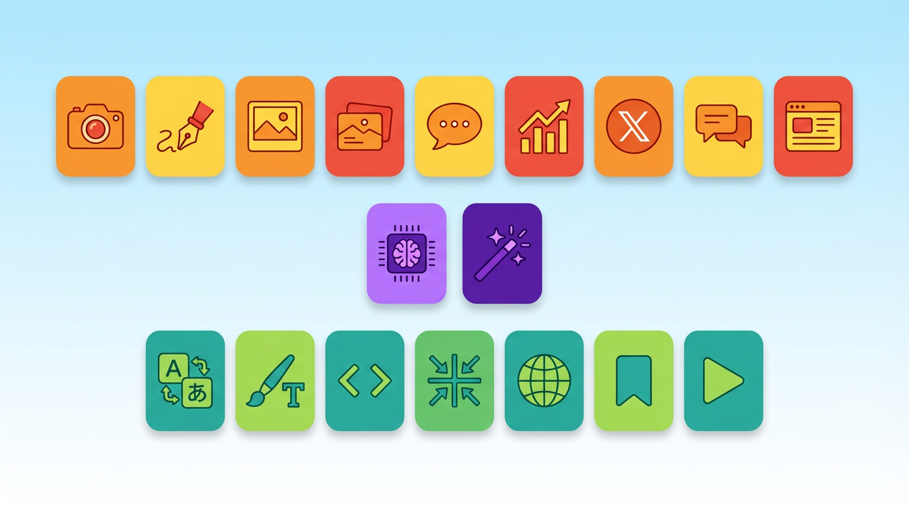
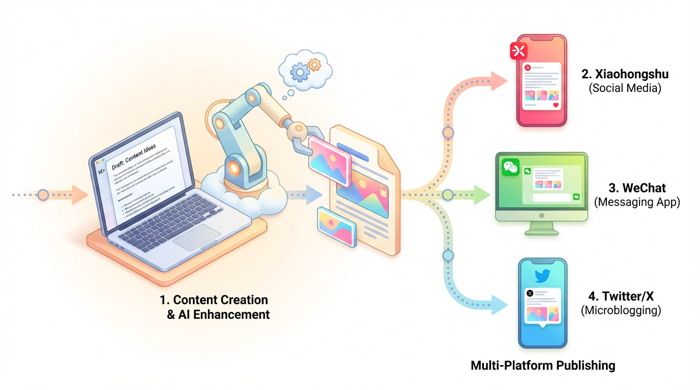
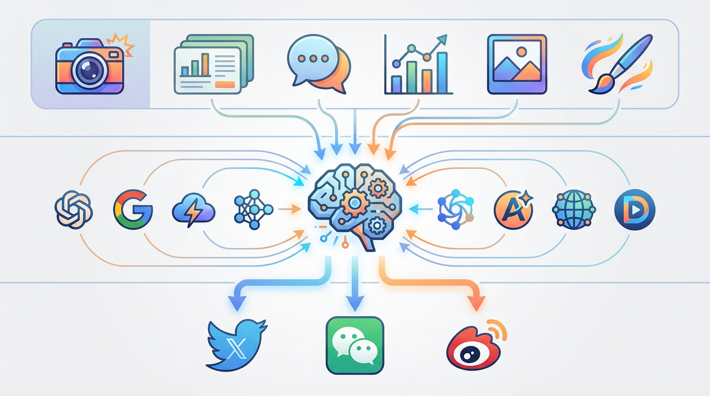

# 用 AI 搞定内容全流程：Baoyu-Skills 使用指南

> 从创作到发布，18 个 AI 技能帮你打通内容生产力闭环。


## 一句话理解 Baoyu-Skills

Baoyu-Skills 是一套运行在 Claude Code 上的 AI 技能插件，覆盖了**写作、配图、排版、翻译、发布**的内容全流程。你只需要用自然语言描述需求，AI 就能自动编排多个技能完成工作。

## 它能做什么？



### 🎨 内容创作（9 个技能）

| 技能 | 一句话说明 | 典型场景 |
|------|-----------|---------|
| **小红书图片** | 11 种风格 × 8 种布局，批量出图 | "帮我把这篇文章做成小红书图文" |
| **文章配图** | 智能分析文章，自动标注配图位置 | "给这篇技术博客配 5 张插图" |
| **封面生成** | 五维定制（色板/渲染/文字/情绪/字体） | "生成一张 16:9 的文章封面" |
| **幻灯片** | 内容→幻灯片图片→PPTX/PDF | "把这篇论文做成 15 页演示文稿" |
| **知识漫画** | 5 种画风 × 7 种色调 × 6 种版式 | "用漫画解释什么是 RAG" |
| **信息图** | 21 种布局 × 20 种风格 | "做一张 AI 技术栈的信息图" |
| **发布到 X** | 支持图文/视频/长文 Article | "把这篇文章发到 Twitter" |
| **发布到微信** | API + 浏览器双通道 | "发布到公众号，用 grace 主题" |
| **发布到微博** | 支持头条文章 | "同步发一条微博" |

### 🔧 工具类（7 个技能）

| 技能 | 一句话说明 | 典型场景 |
|------|-----------|---------|
| **翻译** | 快速/标准/精翻三模式 | "把这篇英文论文翻译成中文" |
| **Markdown 格式化** | 排版整理，不改语义 | "帮我整理这篇文章的排版" |
| **MD→HTML** | 带内联 CSS，适配公众号 | "转成公众号能用的 HTML" |
| **图片压缩** | 自动选择最优工具链 | "把这些图压缩成 WebP" |
| **网页→Markdown** | Chrome 抓取，智能提取正文 | "把这个网页保存为 Markdown" |
| **X→Markdown** | 推文/线程/文章→MD | "保存这条推文线程" |
| **YouTube 字幕** | 无需 API Key，支持多语言 | "下载这个视频的中英文字幕" |

### ⚡ AI 引擎（2 个技能）

| 技能 | 说明 |
|------|------|
| **baoyu-image-gen** | 统一 7 家 API（OpenAI/Google/DashScope/即梦等），是所有图像生成的底层引擎 |
| **Gemini Web** | 逆向 Gemini Web 接口，支持多轮对话和图像生成 |

## 快速上手：三步开始

### 第一步：安装插件

在 Claude Code 中安装 baoyu-skills 插件，插件会自动注册所有 18 个技能。

### 第二步：首次配置

第一次使用图像生成相关技能时，系统会自动引导你完成配置：

- **选择 AI 图像提供商**：OpenAI、Google、DashScope 等
- **设置 API Key**：安全存储在本地配置文件中
- **选择默认参数**：质量、比例、输出目录等

配置保存在 `EXTEND.md` 文件中，后续使用无需重复设置。

### 第三步：用自然语言开始

```
你：帮我把这篇文章做成小红书图文，风格清新一点

AI：
→ 分析文章内容...
→ 推荐 fresh 风格 + balanced 布局
→ 确认后开始生成 6 张图片
→ 封面先出，后续图保持视觉一致
→ 完成！图片保存在 xhs-images/your-topic/
```



## 实战案例：一篇文章的全流程

假设你写了一篇技术文章，想要全平台发布：

```
第 1 步：排版 → "帮我格式化这篇 Markdown"
         ↓ baoyu-format-markdown 自动整理

第 2 步：配图 → "给文章配 3 张插图"
         ↓ baoyu-article-illustrator 分析 + 生图

第 3 步：封面 → "生成一张封面，蓝色系"
         ↓ baoyu-cover-image 五维定制

第 4 步：发微信 → "发布到公众号"
         ↓ baoyu-markdown-to-html 转换
         ↓ baoyu-post-to-wechat 自动发布

第 5 步：发 X → "同步发到 Twitter"
         ↓ baoyu-post-to-x 浏览器发布

第 6 步：做小红书 → "做成小红书图文"
         ↓ baoyu-xhs-images 批量出图
```

每一步都是自然语言驱动，AI 自动选择和编排合适的技能。



## 架构一览

```
用户请求（自然语言）
    │
    ├── 内容创作层 ──→ 小红书/幻灯片/漫画/信息图/封面/配图
    │       │
    │       └── 调用 AI 引擎 → baoyu-image-gen（7 家 API）
    │                        → Gemini Web（逆向接口）
    │
    ├── 发布层 ─────→ X / 微信公众号 / 微博
    │       │
    │       └── 依赖 → markdown-to-html（渲染）
    │                → Chrome CDP（浏览器自动化）
    │
    └── 工具层 ─────→ 翻译 / 格式化 / 压缩 / 网页抓取 / 字幕下载
```

## 几个实用技巧

**1. 风格一致性**

多张图生成时，第一张作为参考图（`--ref`），后续图自动保持视觉风格统一。

**2. 分步执行**

大型任务可以拆步骤：先 `--outline-only` 看大纲，再 `--prompts-only` 审 prompt，最后 `--images-only` 生图。

**3. 多账号发布**

微信公众号支持多账号配置，`--account` 切换不同公众号发布。

**4. 批量处理**

`baoyu-image-gen` 支持 `--batchfile` 批量模式，适合同时生成大量图片。

## 环境要求

| 依赖 | 用途 | 安装方式 |
|------|------|---------|
| Bun | TypeScript 运行时 | `brew install oven-sh/bun/bun` |
| Chrome | 浏览器自动化（发布类技能） | 系统自带或手动安装 |
| API Key | 图像生成（按提供商） | 首次使用时配置 |

## 开始使用

Baoyu-Skills 是开源项目，安装即用。无论你是内容创作者、技术博主还是自媒体运营，这套工具都能大幅提升你的内容生产效率。

**一句话总结：写完文章，剩下的交给 AI。**
